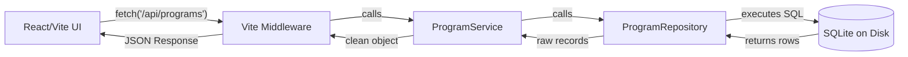

# 🏛️ Golha Admin Panel Architecture (v5.1)

This document describes the optimized, layered architecture of the Radio Golha Admin Panel, built on a **Zero-Server, Direct-to-Disk** philosophy.

---

## 🚀 Design Philosophy
Instead of running a separate external server (e.g., Express), we leverage the native **Vite Dev Server** to provide high-speed, 100% offline data access. 

### Key Benefits:
- **Zero Latency:** Network overhead is eliminated by using a local Node.js process.
- **Direct Disk Access:** The core database is read directly from its physical location on your disk (`database/golha_database.db`).
- **N-Tier Layering:** Strict Separation of Concerns (SoC) ensures code integrity and maintainability.

---

## 🏗️ System Layers

### 1. Infrastructure Layer (Vite Middleware)
- **Path:** `admin/vite.config.ts`
- **Role:** Intercepts `/api/*` requests and routes them to the Service layer.
- **Rule:** No SQL logic should ever live in this file; it acts solely as a Gateway.

### 2. Generic Database Layer (Shared Library)
- **File:** `admin/src/api/repositories/Database.ts`
- **Role:** Centralized `Singleton` manager for the SQLite connection. Provides generic methods (`query`, `getOne`).

### 3. Data Access Layer (Repository Layer)
- **File:** `admin/src/api/repositories/ProgramRepository.ts`
- **Role:** **The Sole Source of SQL Logic.** All normalized relational queries (Programs, Performers, Timeline) are encapsulated here in dedicated methods.
- **Methods:** `findAll`, `findById`, `findSingers`, `findPoets`, etc.

### 4. Orchestration Layer (Service Layer)
- **File:** `admin/src/api/services/ProgramService.ts`
- **Role:** Business logic and Data Transformation. It orchestrates calls to the Repository and maps raw database rows into clean, structured objects for the UI.

### 5. Presentation Layer (React UI)
- **Path:** `admin/src/routes/programs/`
- **Role:** Modern, glassmorphism-themed UI built with TanStack Router, Shadcn/UI, and TailwindCSS.

---

## ⚙️ Data Flow Visualization

---

## 🛠️ Developer Checklist
- **Run project:** `cd admin && npm run dev`
- **Port:** The Admin runs on `http://localhost:3336`.
- **Requirements:** The `sqlite3` package must be installed in the `/admin` directory.

---

## 📝 Related Documentation
- [Database Schema (v5.1)](file:///Users/espitman/Documents/Projects/radioGolha/docs/db_schema_renderer.html)
