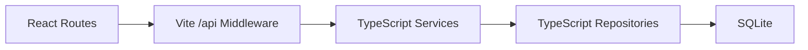
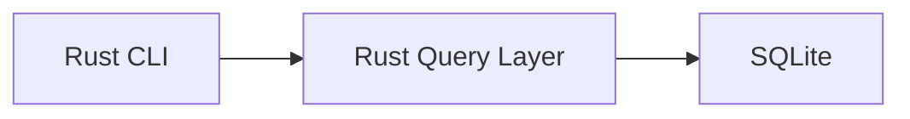
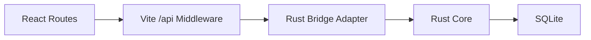

# Golha Admin to Rust Core Migration Plan

## Status

Draft technical design for migrating the Admin Panel data-access layer from TypeScript repositories to the shared Rust core.

## Background

The project now has two parallel implementations of archive logic:

- The current Admin Panel reads SQLite through Node/Vite and TypeScript repositories.
- The new `core/` crate reads the same SQLite database through Rust.

This duplication is acceptable during exploration, but it should not remain the long-term architecture. Every new rule, bug fix, or normalization change currently risks diverging between:

- `admin/src/api/repositories/*`
- `core/src/*`

Because the archive database is local, read-only, and stable, this project is an excellent fit for a shared core architecture with thin clients on top.

## Goal

Make the Rust core the single source of truth for archive querying and domain mapping, while keeping the Admin Panel as a React/Vite desktop-style internal tool.

The Admin should keep its current UI and routes, but its data should gradually come from Rust instead of TypeScript SQL repositories.

## Non-Goals

- Replacing the Admin UI
- Introducing a remote backend
- Rewriting the Admin in Rust
- Solving mobile/native bindings in the first phase
- Changing the canonical SQLite schema beyond what the archive already needs

## Why Migrate the Admin First

The Admin Panel is the safest first consumer of the shared core because:

- it already exercises the most important archive queries
- it is used for data verification, so query correctness matters more than UI novelty
- it runs locally, so there is no backend dependency to untangle
- it gives us a fast feedback loop before Android, iOS, macOS, or Windows clients are started

In practice, the Admin becomes the first real integration test for the Rust core.

## Current Architecture

Today the Admin follows this flow:

The Rust core currently exists in parallel:

## Target Architecture

The target state is:

Key rule:

- SQL and archive mapping logic must live in Rust.
- The Admin should only handle request parsing, calling the bridge, and rendering returned DTOs.

## Proposed Integration Strategy

For the first migration phase, use a JSON bridge between Node and Rust.

### Why a JSON bridge first

- Lowest complexity
- Fastest path to validation
- No native Node addon work at the start
- Easy to inspect and debug
- Keeps the Admin migration incremental

### Bridge shape

Node/Vite will invoke a Rust command with a named use case and JSON arguments, and Rust will return JSON to stdout.

Example conceptual flow:

1. Admin route calls `/api/programs?page=1&query=...`
2. Vite handler parses the request
3. A small Node adapter invokes Rust
4. Rust executes the use case against SQLite
5. Rust returns JSON DTOs
6. Admin returns that JSON to the React UI

This keeps the Admin architecture familiar while moving truth into the core.

## Rust Core Responsibilities

The Rust core should own:

- opening the canonical SQLite archive
- query execution
- pagination
- filtering
- full response shaping
- timeline aggregation and mapping
- domain-specific formatting and normalization rules
- error classification suitable for client consumption

The Rust core should not own:

- React state
- route handling
- UI formatting details
- CSS/layout concerns
- playback UI
- browser-specific behavior

## DTO Contract Principle

The Rust core should return stable DTOs instead of raw rows.

Examples:

- `DashboardSummaryResponse`
- `ProgramListResponse`
- `ProgramDetailResponse`
- `ArtistListResponse`
- `LookupListResponse`

This allows the Admin and future native clients to consume the same response contract.

The TypeScript layer should not re-derive domain logic from raw SQL rows.

## Migration Scope

### Phase 1

Move the Admin read path for:

- dashboard
- program list
- program detail

These endpoints already cover the most important archive complexity:

- category filters
- singer filters
- pagination
- timeline rendering
- orchestra leader resolution
- mode display
- sub-number display

### Phase 2

Move:

- artist list
- orchestra list
- instrument list
- mode list

### Phase 3

Delete obsolete TypeScript repositories and keep only thin request adapters in the Admin.

## Suggested Endpoint Mapping

The Rust core should expose use cases equivalent to the Admin API surface:

- `dashboard_summary`
- `list_programs`
- `get_program_detail`
- `list_artists`
- `list_orchestras`
- `list_instruments`
- `list_modes`

Possible Admin-to-core mapping:

| Admin API | Rust use case |
| --- | --- |
| `/api/dashboard` | `dashboard_summary` |
| `/api/programs` | `list_programs` |
| `/api/program/:id` | `get_program_detail` |
| `/api/artists` | `list_artists` |
| `/api/orchestras` | `list_orchestras` |
| `/api/instruments` | `list_instruments` |
| `/api/modes` | `list_modes` |

## Bridge Design

Add a small adapter in the Admin, for example:

- `admin/src/api/rust/runRustQuery.ts`

Its job should be limited to:

- locating the Rust binary or invoking `cargo run` in development
- passing JSON input
- reading stdout
- parsing JSON output
- normalizing process-level errors

It should not contain archive logic.

## Development vs Production Strategy

### Development

The Admin can call:

- `cargo run -- <command>`

This is slower, but acceptable while the bridge contract is still evolving.

### Production-like local packaging

Once the bridge stabilizes, build the Rust core once and call the compiled executable directly.

That avoids:

- `cargo` startup overhead
- toolchain dependency during routine Admin usage

## Error Handling

The Rust core should return structured errors whenever possible.

Suggested categories:

- database open failure
- invalid input
- record not found
- unsupported filter combination
- internal query failure
- serialization failure

The Node bridge should map these to stable HTTP responses without inventing new domain logic.

## Performance Considerations

The archive is local and read-only, so performance should be good even with a process bridge, but a few rules matter:

- avoid per-row subprocess calls
- one bridge call should fulfill one full endpoint response
- Rust should do the heavy query and mapping work in one pass
- response DTOs should already be UI-ready

This means the subprocess overhead stays small relative to the total work.

## Risks

### 1. Dual-source drift during migration

As long as TypeScript repositories and Rust core both exist, there is a risk of behavior mismatch.

Mitigation:

- migrate endpoint-by-endpoint
- compare JSON outputs during rollout
- remove old repository code as soon as the Rust version is trusted

### 2. Contract churn

If DTO shapes keep changing, Admin integration will stay fragile.

Mitigation:

- define response structs early
- keep shape compatibility close to the current Admin API

### 3. Rust toolchain friction on developer machines

First-time setup can take time because `rustup` installs the stable toolchain.

Mitigation:

- document setup once
- switch Admin bridge from `cargo run` to compiled binaries after the contract stabilizes

### 4. Overusing the bridge for tiny operations

If the Admin calls Rust too frequently for small fragments, latency and complexity go up.

Mitigation:

- keep bridge calls coarse-grained
- return full endpoint payloads

## Recommended Rollout Plan

### Step 1

Stabilize Rust response types for:

- dashboard
- program list
- program detail

### Step 2

Build the Admin Rust adapter and wire a feature flag or temporary switch for:

- `/api/dashboard`

### Step 3

Migrate:

- `/api/programs`

### Step 4

Migrate:

- `/api/program/:id`

### Step 5

Validate output parity against the existing Admin behavior.

### Step 6

Migrate the remaining lookup/list endpoints.

### Step 7

Delete obsolete TypeScript repositories and simplify the Admin API layer.

## Directory Impact

Expected additions:

- `admin/src/api/rust/`
- `core/src/use_cases/` or equivalent module grouping
- shared documentation for DTO contracts

Expected deletions later:

- most SQL-heavy files under `admin/src/api/repositories/`

## Success Criteria

This migration is successful when:

- the Admin UI works without TypeScript SQL repositories
- all Admin archive reads come from Rust DTOs
- Rust becomes the single source of archive logic
- the same core is ready to be reused by native clients later

## Recommendation

Proceed with a phased migration starting from:

1. `dashboard`
2. `programs list`
3. `program detail`

This sequence provides the best balance of value, visibility, and implementation safety.
